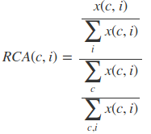
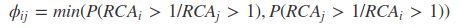

# Tesis de maestría

Repositorio para la tesis de maestría en _Data Mining and Knowledge Discovery_ de Diego Kozlowski

Estructura:

## Comercio Agregado

Una primera parte de la tesis se basa en el análisis del comercio total entre países. Esta sección se divide de la siguiente manera:

- Metodologı́a
- Representación del comercio internacional del año __2016__ en un grafo dirigido
- Análisis del movimiento entre 1997-2016 [Dataset de _comtrade_]
- Análisis del movimiento entre 1950-2000 [Dataset de _Gleditsch_]

Esta parte de la tesis se basa en:

1. Trabajo de especialización DM&KD
2. Trabajo presentado en [_Young Scholars Initiative_](https://github.com/DiegoKoz/grafo_comercio_agregado/tree/YSI)
3. Trabajo presentado en [_LatinR_](https://github.com/DiegoKoz/grafo_comercio_agregado/tree/master)

Sobre la base de trabajo de especialización:

1. En __2__ se incorporó el análisis de la serie 1950-2000 para buscar evidencias de la _nueva división interanacional del trabajo_ 
2. En __3__ se incorporó un desarrollo metodológico de la construcción del grafo y las métricas utilizadas.
3. Por los comentarios recibidos en _YSI_ se redefinió el punto de corte del grafo a partir del coeficiente de clustering
4. Se actualizó la base de datos, mejorando la consistencia de la misma y extendiendo el período hasta 2016

Además se construyó una herramienta interactiva para la visualización de la información:

- [__shiny distribución de nodos__](https://diegokoz.shinyapps.io/Distribucion_nodos_wrdtrade/)

## Comercio a nivel producto

Una segunda instancia del trabajo se encuentra en desarrollo en el repo [DiegoKoz/southamerica_commerce_graph](https://github.com/DiegoKoz/southamerica_commerce_graph).

Allí lo que se busca es analizar el comercio desagregado a nivel producto, y se concentra en las posibles integraciones regionales de Sudamérica. Esta sección se divide de la siguiente manera:

### Análisis exploratorio de datos

Se construyó un [__shiny__](https://treemaps.shinyapps.io/treemaps/) donde se obsveran las distribuciones del comercio de los países sudaméricano en términos de:

- exportaciones-importaciones entre países por año
- Estructura de la canasta exportada/importada de cada país hacia El resto de sudamérica / El resto del mundo / China

Para esto se tomo por base un nomenclador de cadenas productivas y de uso de productos (Molinari y Angelis, 2016)

### LDA

Buscando un agrupamiento alternativo de los productos, se esta desarrollando una técnica basada en latent dirichlet allocation (David M. Blei Andrew Y. Ng, 2003). Esta técnica se utiliza en Text Mining para encontrar los _tópicos subyacentes_ en un corpus de texto. Aquí se reformula para encontrar _componentes subyacentes del espacio de productos_. 

Los resultados preliminares se encuentran en:

- https://treemaps.shinyapps.io/LDA_worldtrade/ 

Estos Resultados fueron presentados en _ECON2018_. Además, se esta trabajando en un seminario de investigación en la FCE-UBA para la presentación de la herramienta y en la publicación de la metodología y los resultados.

### Grafo Bipartito

Basado en Hidalgo and Hausmann (2009), se estudiará la representación del comercio internacional como un grafo bipartito de países y productos. La proyección del grafo bipartito construye un espacio de productos y un espacio de países. De aquí se define la similitud entre los productos a partir de que son exportados en tandem, y similitud de los países a partir de sus canastas exportadoras similares.

Además, los autores proponen una métrica de ventajas comparativas relativas, _Relative Comparative Advantages_ 

dónde x(c,i) es el valor de las exportaciones del __país c__ en el __producto i__     

A partir de esta métrica, los Hausman e Hidalgo proponen que la similitud entre países dos países, {i,j} se puede definir como: 

El objetivo de trabajo es:

- estudiar la sensibilidad del treshold implícito en esta métrica (que los autores definen en 1)
- comparar los resultados con lo obtenido en LDA, en tanto ambos modelos permiten clusterizar el espacio de productos
- analizar los resultados desde el punto de vista de la integración comercial sudamericana

## Bibliografía

David M. Blei Andrew Y. Ng, Michael I Jordan. 2003. “Latent Dirichlet Allocation.” Journal of Machine Learning Research 3: 993–1022.

Hidalgo, C. A., B. Winger, A. L. Barabási, and R. Hausmann. 2007. “The product space conditions the development of nations.” Science 317 (5837): 482–87. https://doi.org/10.1126/science.1144581.

Hidalgo, César, and Ricardo Hausmann. 2009. “The building blocks of economic complexity.” Proceedings of the National Academy of the Sciences of the United States of America 106 (26): 10570–5. https://doi.org/10.1073/pnas.0900943106.

Molinari, Andrea, and Jesica Yamila de Angelis. 2016. “Especialización y complementación productiva en el MERCOSUR: un Enfoque de Cadenas Productivas de Valor.” Instituto Interdisciplinario de Economía Política de Buenos Aires.

