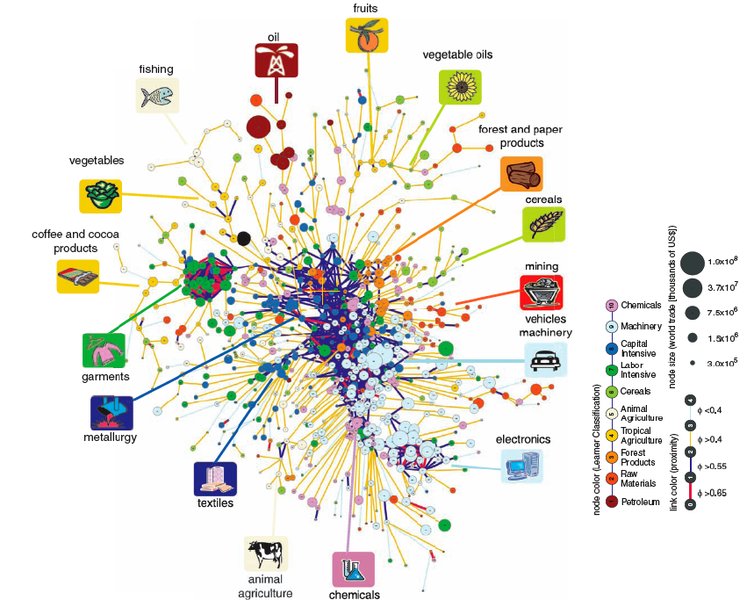
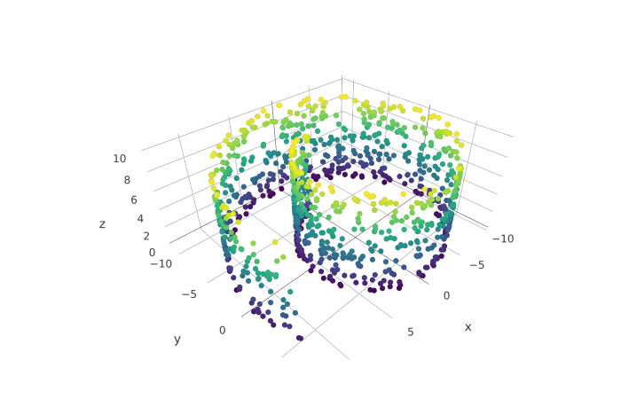
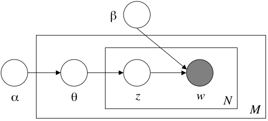
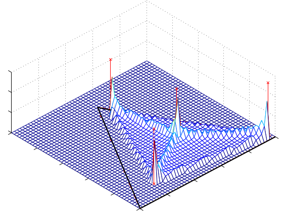
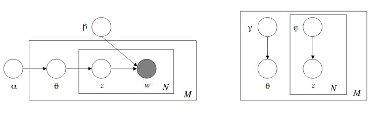

## Problema

- El comercio internacional se puede pensar como la interacción de cientos de __países__, miles de __productos__, a lo largo de cientos de __años__, en diversas __direcciones__(expo-impo). 

- El problema vive en 
$$\mathcal{R}^{N*P*Y*T}$$

- Esta estructura compleja de interacciones se suele caracterizar con grandes agregados sobre alguna dimensión, perdiendo la riqueza de la información sobre las demás. 

## Propuestas

Este grupo de trabajo se propone explorar nuevos métodos de representación del comercio internacional: 

- Basados en Teoría de Grafos  (Hidalgo and Hausmann (2009))

- Basados en Modelos generativos (David M. Blei Andrew Y. Ng (2003))

Ambas lineas de trabajo se proponen abarcar las dos dimensiones que suponen más complejidad:

- Países
- Productos
- Para ello, es conveniente pensar cada una de estas como un subespacio del problema. 
- En esta presentación se hará hincapié sobre la segunda linea de trabajo

## Product Space

Este espacio define una métrica de __distancias entre productos__: El objetivo es poder _comparar peras con manzanas_.

La _similaridad_ en la propuesta de Hidalgo se basa en la proyección de un grafo bipartito construido a partir de la _Relative Comparative Advantages_ de los países.

## Antecedentes

__Objetivo__: Representación _agnóstica_ del _product space_

- Nuestra propuesta es buscar un concepto de similaridad alternativo, basado en un modelo generativo.

- Para ello, nos basamos en el modelo propuesto por David M. Blei Andrew Y. Ng (2003), que fue originalmente pensado para encontrar __dimensiones subyacentes__ en un corpus de texto, comprendido como los _tópicos de los que habla el texto_. 

- Intuitivamente, la extrapolación que realizamos en esta propuesta, se basa en considerar las _dimensiones latentes_ del comercio internacional como __clusters difusos__ en los que se agrupan los productos. 

- La idea de definir clusters donde cada producto puede pertenecer a más de un grupo (difusos) tambien esta basada en Molinari and Angelis (2016)

## LDA 

### Definiciones

- Un ___producto___ es la _unidad básica discreta de los datos_, se define como un ítem de un nomenclador (SITC). Se representa como un vector unitario. Definimos el superíndice $i$ del vector como el i-ésimo producto del nomenclador y el i-ésimo elemento del vector. El V-ésimo producto del nomenclador es el vector $w$, tal que $w^v$=1 y $w^u$=0, $u\neq v$
- Un ___país___ es una secuencia de __N__ productos, definido como $W= (w_1, w_2, ..., w_N)$
- Nuestro __corpus__ es la colección de __M__ países, definido como $D = (d_1, d_2,..., d_M)$
- Un ___componente___ es una dimensión latente sobre el corpus, y suponemos una cantidad fija _k_ de los mismos. 

- Nuestro objetivo es obtener: 

1. Una distribución de componentes sobre cada país. 
2. Una distribución de los productos sobre los componentes.

## Dimensión latente

- Nuestros datos están definidos en una dimensión alta $$\mathcal{R}^{N*P*Y*T}$$
- Podemos encontrar un espacio de menor dimensión en el que se logra representarlos bien

## Proceso generativo

Intuitivamente, suponemos el siguiente proceso generativo de datos:

- Para cada país del corpus, imaginamos que las exportaciones surgen de un proceso de dos etapas:
  - Elegimos aleatoriamente una distribución sobre los componentes
  - Para cada dólar exportado:
      - Elegimos aleatoriamente el componente al que pertence, dada la distribución definida en el paso anterior
      - Elegimos aleatoriamente un producto de la distribución correspondiente a dicho componente

1. Para cada Componente $k \in \{1,2,... K\}$
  - Generar una distribución sobre los componentes $\beta \sim Dir_v(\eta)$ con $\eta \in \mathcal{R_{>0}}$ un parámetro fijo
  
2. Para cada país $d \in \{1,2,... D\}$
  - generar un vector de proporciones de componentes $\theta_d \sim Dir_K(\alpha)$ con $\alpha \in \mathcal{R_{>0}^K}$ un parámetro fijo
  - Para cada dólar exportado:
    i. generar una asignación del componente $z_{dn} \sim Mult(\theta_d)$
    ii. asignar el producto $w_{dn} \sim Mult(\beta_{zn})$

## Representación gráfica

- Cada nodo representa una distribución de probabilidad.
- La arista significa que la distribución de salida define los parámetros de la distribución de entrada
- Los recuadros significan replicación: 
  - El recuadro interior representa que el proceso se realiza para cada dólar exportado en el país.
  - El recuadro exterior representa que el proceso se realiza para cada país en el corpus.

## Distribución de Dirichlet

Un Proceso de Dirichlet es una familia de procesos estocásticos donde __las realizaciones son ellas mismas distribuciones de probabilidad.__ 

Es decir, el rango de esta distribución (así como en una normal son los reales) son distribuciones de probabilidad.

Para interpretarlo geométricamente, podemos pensar un ejemplo de la distribución de densidad para __3 productos__ y __4 componentes__.

\

- El triángulo representa todas las distribuciones (multinomiales) posibles sobre los tres productos
- Cada uno de los vértices del triángulo es una distribución de probabilidad que asigna una probabilidad de 1 a uno de los productos. 
- El punto medio de cada lado, es una distribución con probabilidad 0.5 a dos componentes. 
- El cuarto componente, el centroide del triángulo, asigna probabilidad de $\frac{1}{3}$ a cada producto.
- Los cuatro puntos marcado con x son las distribuciones multinomiales de p(w|z) para cada uno de los cuatro componentes.
- La altura en el eje z es una posible distribución de densidad sobre el simplex, es decir, sobre las distribuciones de densidad multinomiales, dada por LDA

## Inferencia

Cuando observamos los datos, no contamos con los tópicos ni con su distribución, sino con los productos y países. El objetivo es realizar inferencia sobre las variables latentes, mediante el Teorema de Bayes:

$$
p(\theta,z|w,\alpha,\beta) = \frac{p(\theta,z,w|\alpha,\beta)}{p(w|\alpha,\beta)}
$$

Nuestra función objetivo es:

$$
\ell(\alpha, \beta) = \sum_{d=1}^M \log p(w_d|\alpha,\beta)
$$

El problema es que esta ecuación es intratable, por la interacción entre $\theta$ y $\beta$

Por ello, la inferencia se realiza sobre una familia de modelos que se sabe que son una cota inferior de probabilidad, y que son tratables.

- Estos modelos tienen parámetros variacionales, que se ajustan para obtener el modelo que más se acerca a la cota inferior.
- La forma de obtener una familia de modelos tratables es considerar algunas modificaciones sobre el modelo gráfico original, removiendo nodos y aristas. 

## Estimación de parámetros

Podemos aproximar los parámetros alternando el proceso de _variational Expectation Maximization_ (EM):

- __paso E__: Optimizamos los parámetros variacionales $\gamma, \varphi$
- __paso M__: Para los valores fijos $\gamma, \varphi$, maximizamos la cota inferior respecto a los parámetros del modelo, $\alpha,\beta$

Estos dos pasos se alternan hasta converger.

Por último, se realiza un suavizado sobre las probabilidades que un componente asigna a un producto, para que sean siempre mayores a 0.

## Bibliografía

David M. Blei Andrew Y. Ng, Michael I Jordan. 2003. “Latent Dirichlet Allocation.” Journal of Machine Learning Research 3: 993–1022.

Hidalgo, C. A., B. Winger, A. L. Barabási, and R. Hausmann. 2007. “The product space conditions the development of nations.” Science 317 (5837): 482–87. https://doi.org/10.1126/science.1144581.

Hidalgo, César, and Ricardo Hausmann. 2009. “The building blocks of economic complexity.” Proceedings of the National Academy of the Sciences of the United States of America 106 (26): 10570–5. https://doi.org/10.1073/pnas.0900943106.

Molinari, Andrea, and Jesica Yamila de Angelis. 2016. “Especialización y complementación productiva en el MERCOSUR: un Enfoque de Cadenas Productivas de Valor.” Instituto Interdisciplinario de Economía Política de Buenos Aires.
